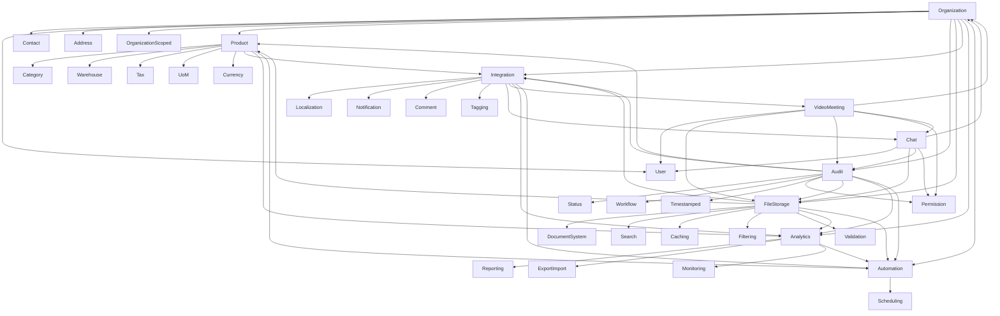

# Base Models Classification

## 1. Core Foundation Models
- **Organization/** - Base organization structure
- **User/** - User management
- **Contact/** - Contact information
- **Address/** - Address management
- **OrganizationScoped/** - Organization scoping

## 2. Business Domain Models
- **Product/** - Product management
- **Category/** - Product categorization
- **Warehouse/** - Inventory management
- **Tax/** - Tax management
- **UoM/** - Unit of Measurement
- **Currency/** - Currency management

## 3. System Infrastructure Models
- **Audit/** - Audit logging
- **Status/** - Status tracking
- **Workflow/** - Workflow management
- **Timestamped/** - Timestamp management
- **Permission/** - Permission management

## 4. Data Management Models
- **FileStorage/** - File storage
- **DocumentSystem/** - Document management
- **Search/** - Search functionality
- **Caching/** - Caching system
- **Filtering/** - Data filtering
- **Validation/** - Data validation

## 5. Integration & Communication Models
- **Integration/** - System integration
- **Localization/** - Internationalization
- **Notification/** - Notification system
- **Comment/** - Comment system
- **Tagging/** - Tagging system
- **Chat/** - Real-time chat system
- **VideoMeeting/** - Video conferencing system

## 6. Analytics & Reporting Models
- **Analytics/** - Analytics
- **Reporting/** - Reporting
- **ExportImport/** - Data export/import
- **Monitoring/** - System monitoring

## 7. Automation Models
- **Automation/** - Automation
- **Scheduling/** - Task scheduling

## Model Relationships

## Implementation Order

1. **Core Foundation Models**
   - Organization
   - User
   - Contact
   - Address
   - OrganizationScoped

2. **System Infrastructure Models**
   - Audit
   - Status
   - Workflow
   - Timestamped
   - Permission

3. **Data Management Models**
   - FileStorage
   - DocumentSystem
   - Search
   - Caching
   - Filtering
   - Validation

4. **Business Domain Models**
   - Product
   - Category
   - Warehouse
   - Tax
   - UoM
   - Currency

5. **Integration & Communication Models**
   - Integration
   - Localization
   - Notification
   - Comment
   - Tagging
   - Chat
   - VideoMeeting

6. **Analytics & Reporting Models**
   - Analytics
   - Reporting
   - ExportImport
   - Monitoring

7. **Automation Models**
   - Automation
   - Scheduling

## Key Integration Points

### Core Foundation Integration
- Organization scoping across all models
- User authentication and authorization
- Contact and address management
- Multi-tenancy support

### System Infrastructure Integration
- Audit logging for all operations
- Status tracking for all entities
- Workflow management
- Permission control
- Timestamp management

### Data Management Integration
- File storage and retrieval
- Document management
- Search functionality
- Caching system
- Data filtering
- Validation rules

### Business Domain Integration
- Product management
- Category hierarchy
- Warehouse operations
- Tax calculations
- Unit conversions
- Currency management

### Communication Integration
- System integration
- Internationalization
- Notifications
- Comments
- Tagging
- Real-time chat
- Video conferencing

### Analytics Integration
- Data analytics
- Reporting
- Export/import
- System monitoring

### Automation Integration
- Process automation
- Task scheduling

## Key Features by Category

### Core Foundation Models
- Organization hierarchy management
- User authentication and authorization
- Contact and address validation
- Business entity management

### System Infrastructure Models
- Role-based access control
- Audit logging and tracking
- Workflow management
- Status tracking

### Data Management Models
- File storage and retrieval
- Document management
- Search functionality
- Data caching
- Data filtering
- Data validation
- Real-time communication
- Video conferencing
- Message persistence
- Meeting management

### Business Intelligence Models
- Analytics and reporting
- Data export/import
- System monitoring
- Process automation
- Task scheduling

## Integration Points

### Core Integration
- Organization scoping across all models
- User authentication and authorization
- Audit logging for all operations
- Status tracking for all entities

### Communication Integration
- Chat integration with:
  - Product discussions
  - Organization communication
  - User messaging
  - Document collaboration
  - Task management
- Video meeting integration with:
  - Product meetings
  - Organization meetings
  - User meetings
  - Document reviews
  - Task discussions

### Data Integration
- File storage for documents
- Search across all models
- Caching for performance
- Validation for data integrity

### Business Integration
- Analytics for all models
- Reporting across all data
- Automation of business processes
- Scheduling of tasks and jobs

## Best Practices

### Implementation Guidelines
1. Always extend from appropriate base models
2. Implement proper validation
3. Use organization scoping where applicable
4. Implement proper access control
5. Include audit logging
6. Use caching for performance
7. Implement proper error handling

### Communication Guidelines
1. Implement proper message persistence
2. Use real-time updates efficiently
3. Handle file sharing securely
4. Manage meeting recordings properly
5. Implement proper access control
6. Use proper error handling
7. Ensure message delivery reliability

### Security Guidelines
1. Use RBAC for access control
2. Implement proper validation
3. Use organization scoping
4. Implement audit logging
5. Use proper encryption
6. Implement proper error handling

### Performance Guidelines
1. Use caching appropriately
2. Implement proper indexing
3. Use bulk operations
4. Optimize queries
5. Use proper data structures
6. Implement proper error handling

## Future Considerations

### Planned Enhancements
1. Enhanced analytics capabilities
2. Improved automation features
3. Better integration capabilities
4. Enhanced security features
5. Improved performance optimizations

### Potential Additions
1. Machine learning integration
2. Advanced analytics
3. Enhanced automation
4. Better integration
5. Improved security

### Communication Enhancements
1. Advanced chat features
   - Message reactions
   - Message editing
   - Message deletion
   - Message threading
   - Advanced search
2. Enhanced video meeting features
   - Virtual backgrounds
   - Breakout rooms
   - Polling
   - Whiteboarding
   - Meeting analytics
3. Integration improvements
   - Better calendar integration
   - Enhanced file sharing
   - Improved screen sharing
   - Better mobile experience 